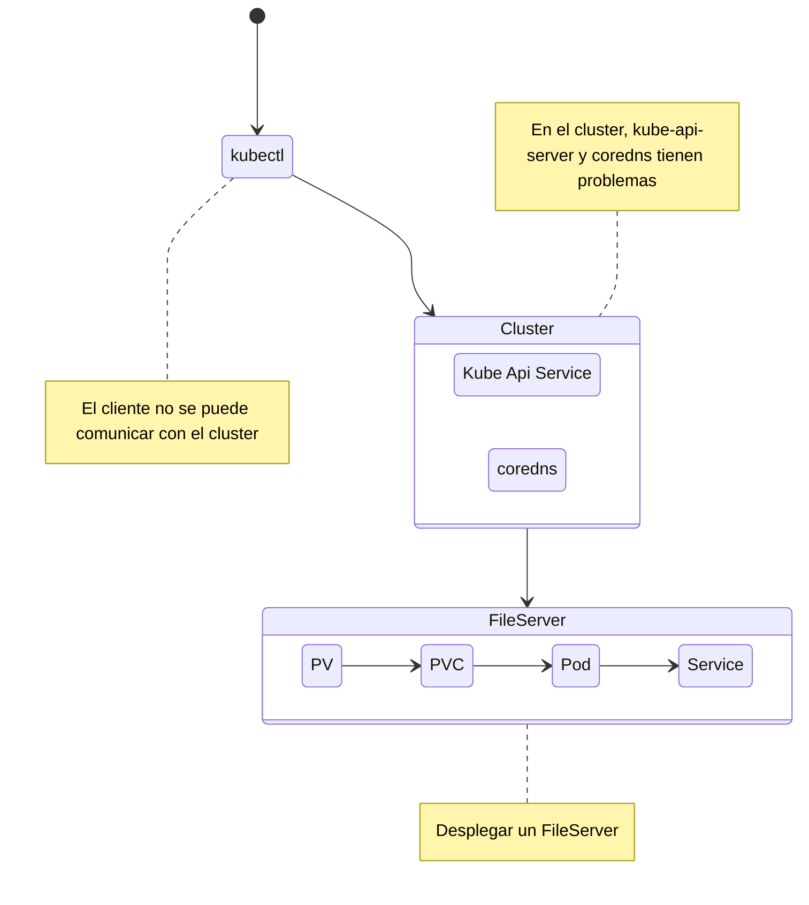

## Reto 02 | Descripcion

### Reparar control plane
### Arreglar la el kube-api-server
### Arreglar el deployment de coredns
### Reparar el nodo01
### Preparar un servidor de archivos usando los objetos PV, PVC, Pod y Service

---



---
### Reparar control plane
#### Reparar coredns
```bash
kubectl get pods -n kube-system
kubectl describe deployment -n kube-system coredn
```

```bash
kubectl edit deployment -n kube-system coredns
## configurar la imagen correcta
```

```bash
kubectl get pods -n kube-system
kubectl describe deployment -n kube-system coredn
```

#### Reparar kube-api-server
La ruta que se envia a travez del argumento `--client-ca-file` no existe, asi que hay que revisar la ruta y ver el nombre correcto

```bash
ls -l /ruta/certificados/para/kubernetes/
# y se actualiza la ruta en el en el kube-apiserver.yaml
vi /etc/kubernetes/manifests/kube-apiserver.yaml
watch crictl ps
# Si el contenedor no inicia reiniciamos `kubelet`
systemctl restart kubelet
```

#### Reparamos la comunicacion con el cluster
Actualizamos el puerto en la configuracion en `./kube/config`

---

### Habilitamos el nodo 01

```bash
kubectl get nodes
# el stado del nodo muestra `Ready,SchedulingDisabled`
kubectl uncordon node01
```
