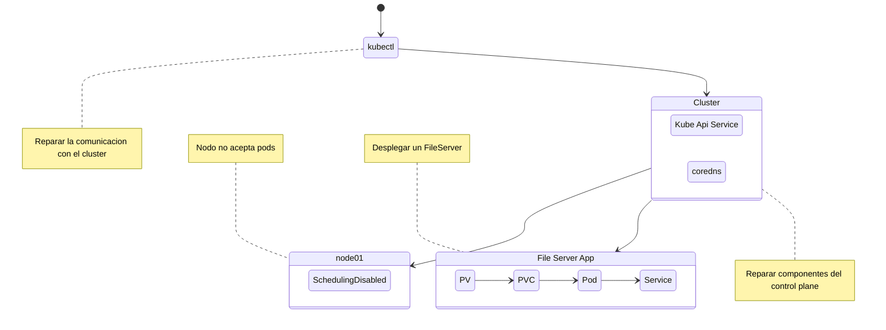

## Reto 02 | Reparando un cluster roto



---
### Reparar componentes del control plane
#### Reparar coredns
```bash
kubectl get pods -n kube-system
kubectl describe deployment -n kube-system coredn
```

```bash
kubectl edit deployment -n kube-system coredns
## configurar la imagen correcta
```

```bash
kubectl get pods -n kube-system
kubectl describe deployment -n kube-system coredn
```

#### Reparar kube-api-server
La ruta que se envia a travez del argumento `--client-ca-file` no existe, asi que hay que revisar la ruta y ver el nombre correcto

```bash
ls -l /ruta/certificados/para/kubernetes/
# y se actualiza la ruta en el en el kube-apiserver.yaml
vi /etc/kubernetes/manifests/kube-apiserver.yaml
watch crictl ps
# Si el contenedor no inicia reiniciamos `kubelet`
systemctl restart kubelet
```

#### Reparamos la comunicacion con el cluster
Actualizamos el puerto en la configuracion en `./kube/config`

---

### Habilitamos el nodo 01

```bash
kubectl get nodes
# el stado del nodo muestra `Ready,SchedulingDisabled`
kubectl uncordon node01
kubectl cordon control-plane
```

---
### Creamos el PVC
Transferimos los archivos del directorio `media/`

```bash
scp /media/* node01:web
```

El manifesto para crear el PVC

```yaml
---
apiVersion: v1
kind: PersistentVolume
metadata:
  name: data-pv
spec:
  accessModes:
  - ReadWriteMany
  capacity:
    storage: 1Gi
  hostPath:
    path: /web
    type: DirectoryOrCreate
```

```bash
kubectl apply -f data-pv.yaml
```
---
### Creamos el PVC

```yaml
---
apiVersion: v1
kind: PersistentVolumeClaim
metadata:
  name: data-pvc
spec:
  accessModes:
  - ReadWriteMany
  resources:
    requests:
      storage: 1Gi
  storageClassName: ""
  volumeName: data-pv
```

---
### Creamos el fileserver Pod

```yaml
---
apiVersion: v1
kind: Pod
metadata:
  labels:
    run: gop-file-server
  name: gop-file-server
spec:
  volumes:
  - name: data-store
    persistentVolumeClaim:
      claimName: data-pvc
  containers:
  - image: kodekloud/fileserver
    imagePullPolicy: IfNotPresent
    name: gop-file-server
    volumeMounts:
    - name: data-store
      mountPath: /web
  dnsPolicy: ClusterFirst
  restartPolicy: Never
```
---
### Exponemos el servicio

```yaml
apiVersion: v1
kind: Service
metadata:
  labels:
    app: gop-fs-service
  name: gop-fs-service
spec:
  ports:
  - name: 8080-8080
    nodePort: 31200
    port: 8080
    protocol: TCP
    targetPort: 8080
  selector:
    run: gop-file-server
  type: NodePort```
